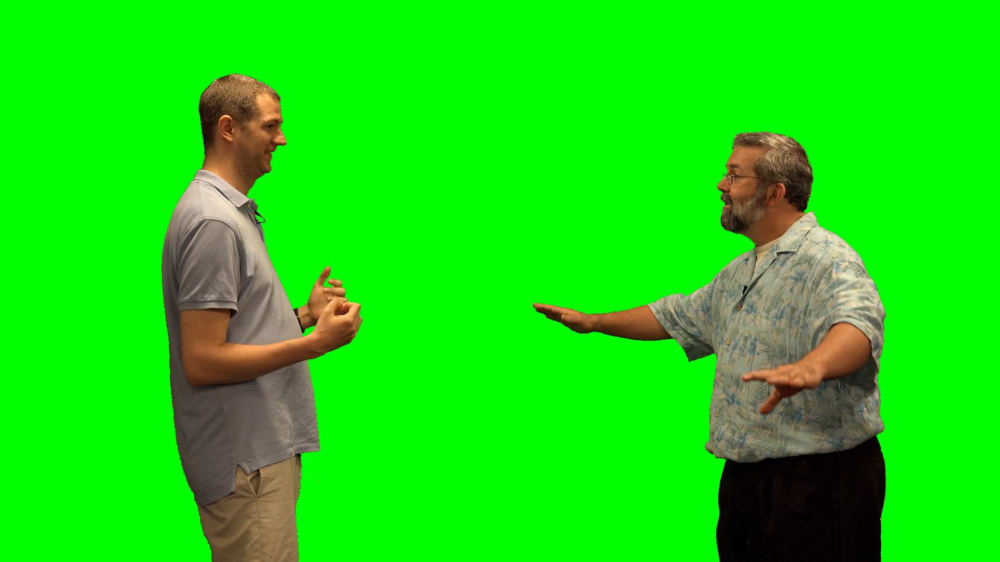

# Programming Foundations with JS, HTML and CSS

Programming Exercise: Modifying Images


## 1

Write a JavaScript program that modifies an image by putting three vertical stripes on it - a red stripe on the left one third, a green stripe in the middle, and a blue stripe on the right one third. For example, if your program ran on Drew’s picture shown on the left, the resulting image would have red, green and blue vertical stripes as shown in the image on the right.


```js
// 1
var img = new SimpleImage("hilton.jpg");
print(img);

for(var pixel of img.values()) {
    if( pixel.getX() <= img.getWidth()/3) {
        pixel.setRed(255);
    }
    else if (pixel.getX() <= 2*img.getWidth()/3) {
        pixel.setGreen(255);
    }
    else {
        pixel.setBlue(255);
    }
}
print(img);
```

---

## 2.

Write code to change the Duke blue devil (the image below on the left) to be yellow (as in the image below on the right)


```js
var img = new SimpleImage("duke_blue_devil.png");
print(img);

for(var pixel of img.values()) {
    // if( pixel.getBlue() == 227){
    if(pixel.getRed()<255){
        pixel.setBlue(0);
        pixel.setRed(255);
        pixel.setGreen(255);
    }
}
print(img);
```

---

## 3.




```js
var img = new SimpleImage("drewRobert.png");
var bgimg = new SimpleImage("dinos.png");
var outimg = new SimpleImage(img.getWidth(), img.getHeight());

for(var pixel of img.values()) {
    if(pixel.getGreen() > pixel.getRed() + pixel.getBlue()){
    // if(pixel.getGreen() > 200){
        var x = pixel.getX();
        var y = pixel.getY();
        var bgpixel = bgimg.getPixel(x,y);
        outimg.setPixel(x,y,bgpixel);
    }
    else {
        outimg.setPixel(pixel.getX(),pixel.getY(),pixel);
    }
}
print(outimg);
```


---

## 4.

Your friend is trying to write a program that draws a square 200 pixels by 200 pixels and that looks like this square with colors red (red value 255), green (green value 255), blue (blue value 255) and magenta (red value 255 and blue value 255). All other RGB values are set to 0.


```java
var img = new SimpleImage(200,200);

for (var px of img.values()){
  var x = px.getX();
  var y = px.getY();
  if (x < img.getWidth()/2){
    px.setRed(255);
  }
  if (y>img.getHeight()/2){
    px.setBlue(255);
  }
  if(x > img.getWidth()/2 && y < img.getHeight()/2) {
    px.setGreen(255);
  }
}
print (img);
```


---

## 5.

write another function named addBorder. This function will add a black border to an image, such as in the following example:


black border that is 10 pixels thick

```java
function setBlack(pixel) {
    pixel.setRed(0);
    pixel.setGreen(0);
    pixel.setBlue(0);
}

var img = new SimpleImage("smallpanda.png");
print(img);
for(var pixel of img.values()) {
    var x = pixel.getX();
    var y = pixel.getY();
    if(y < 10 || y > img.getHeight()-10){
        setBlack(pixel);
    }
    if(x < 10 || x > img.getWidth()-10){
        setBlack(pixel);
    }
}
print(img);
```


---

## quiz

```
week3

Question 1
What is the purpose of initializing the global image variables to null in the green screen web page?
- The code can check if the image is null before processing it.

Question 2
You would like to display an alert message if the image variable for the foreground image fgImage is not loaded. Which two of the following expressions evaluate to true if the image is not ready?
- fgImage == null
- ! fgImage.complete()

Question 3
In which of the following code snippets does the program alert the user "x is null"?
- var x = 2

Question 4
You have created the following file input element:
Which of the following attributes can you add to restrict the file upload to one file?
- accept="image/*" xx

Question 5
You have the following code excerpt to allow a user to select a file from the input element with ID "finput" and display it to a canvas with ID "can."
A script specifying where to find the JavaScript library for SimpleImage

Question 6
You have two pixels to convert to grayscale, and you would like to determine visually whether your code is likely to be working, so you work an example by hand.
The first pixel is teal and has rgb(0,153,153), and the second pixel is purple and has rgb(153,51,255). Once the grayscale pixels are printed, which one should appear as a lighter gray (closer to white).
- First pixel

Question 7
You are building a web page, and you create a text input element and specify an element ID for it. Why did you do this?
- to reference the input element programmatically.

---------------

week4

Question 1
What is the purpose of adding CSS to a web page?
To style the web page

Question 2
Which of the following are examples of nesting? Select all that are correct.
A for loop inside a for loop
A list of lists

Question 3
Consider the following HTML and CSS to make a web page.
Which of the following are errors in this code? Select all that are correct.
- The HTML is missing <html> tags.
- The unordered list inside the ordered list should go inside the list element New York, not after it.
- In the CSS there should be a dot before oddNums to indicate that it is a class.
- The <title> tag should be inside the <head> tag.

Question 4
Consider the following image in which the upper left quadrant is cyan, the upper right quadrant is green, the lower left quadrant is blue, and the lower right quadrant is black:
Now consider the code that attempts to create that image but has a mistake, and instead produces this image, in which the upper left quadrant is blue instead of cyan:
Which of the following is the best explanation of why this code doesn’t produce the first image?
- The code inside the else statement is only applied to pixels that did not satisfy the first if statement. So only pixels in the upper half of the image that are not also in the left half of the image are made green by the if statement inside the else statement.

Question 5
Consider the following short program that defines a function to make an image darker by a certain amount and applies it to the image chapel.png.
- The line that initializes the variable img is missing the keyword var.
- The call to makeDarker does not pass an image as an argument.
- The function makeDarker is missing a return statement so there will be an error when the program assigns the return value of makeDarker to the variable img.

Question 6
Imagine you want to write a program to turn an image into a mirror image of itself. Which of the following would be the best approach to take?
- Work small examples by hand, write down what you did, look for patterns, translate your algorithm to code, test and debug your program.

Question 7
Consider the following JavaScript code.
- grayimage
- image

Question 8
Which is the appropriate event handler to do something once a file has loaded?
- onchange

Question 9
Consider the following code that calls the function filterGreen (code for this function not shown) to apply a green filter to the image greenImage.
- greenImage.drawTo(canvas);

Question 10
Consider the examples you have seen of web pages that enable users to upload images and add filters to them. Which of the following describes what happens when the user clicks a button to add a filter to an image?

1 point

The onclick event handler calls a function that applies the filter to the image, then the filtered image is drawn on the canvas.


The onclick event handler calls the function that draws the image to the canvas, then the filter is added.


The mouseover event handler calls the function that draws the image to the canvas, then the onclick event handler calls the function that applies the filter to the image.


The onclick event handler allows the user to choose an image to apply the filter to, then it calls a function that applies the filter to the image, and the filtered image is drawn on the canvas.


Honor Code Agreement


```

.
