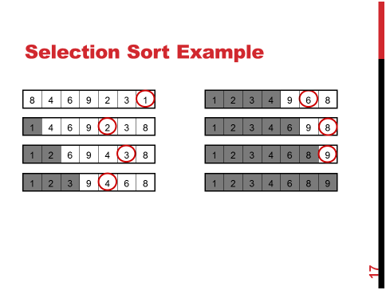
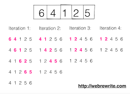

# Data Structure

[toc]

---

## list

```java
List<Integer> newlist = new ArrayList<>();
newlist.add(i);
newlist.remove(new Integer(i));
newlist.get(0);
```

---

## ArrayList
- in order
- index

```java
arr.add();

Student[] arr;
arr = new Student[5];

arr[0] = new Student(1,"aman");
arr[1] = new Student(2,"vaibhav");
arr[2] = new Student(3,"shikar");
arr[3] = new Student(4,"dharmesh");
arr[4] = new Student(5,"mohit");
```

---

## linked list

```java
Deque<Node> d = new LinkedList<Node>();
d.offerFirst(root)
d.pollFirst();


FIFO 从上往下垒 上面先走
Queue<Node> queue = new LinkedList<Node>();
q.add()
q.poll()


LIFO  从下往上垒 上面先走
Stack<Node> s = new Stack<Node>();
s.push()
s.add()
s.pop()
```

---

## HashMap
```java
HashMap<Integer, Integer> ht = new HashMap<>();

Map.Entry<Integer, Integer> entry;
hm.entrySet()
entry.getValue()
entry.getKey()

ht.put(i, ht.getOrDefault(i, 0) + 1);
ht.getOrDefault(i, 0)
ht.get(i)

// Show all hts in hash table.
names = ht.keys();

ht.get("Zara")
```

---

## Set

no duplicate

---

## HashSet

- not in order
- not index

```java
mySet.add();

```

---

# sort

## SelectionSort - keep finding the smallest one

keep finding the smallest one, and put in the `arr[0]`



```java
public void SelectionSort(int[] num) {
    for (int k=0; k < in.size(); j++) {
        int minIndex = k;
        for (int i=k+1; i < num.length; i++) {
            if (num[minIndex] > num[i]) {
                minIndex = i;
            }
        }
        int temp = num[k];
        num[k] = num[minIndex];
        num[minIndex] = temp;    
    }
}
```


## BubbleSort - if bigger, back



- Worst and Average Case Time Complexity: O(n*n). Worst case occurs when array is reverse sorted.
- Best Case Time Complexity: O(n). Best case occurs when array is already sorted.
- Auxiliary Space: O(1)
- Boundary Cases: Bubble sort takes minimum time (Order of n) when elements are already sorted.
- Sorting In Place: Yes
- Stable: Yes


## InsertionSort - if smaller, forward


## QuickSort


## MergeSort


.
