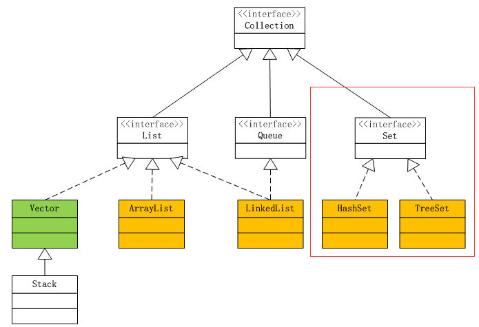
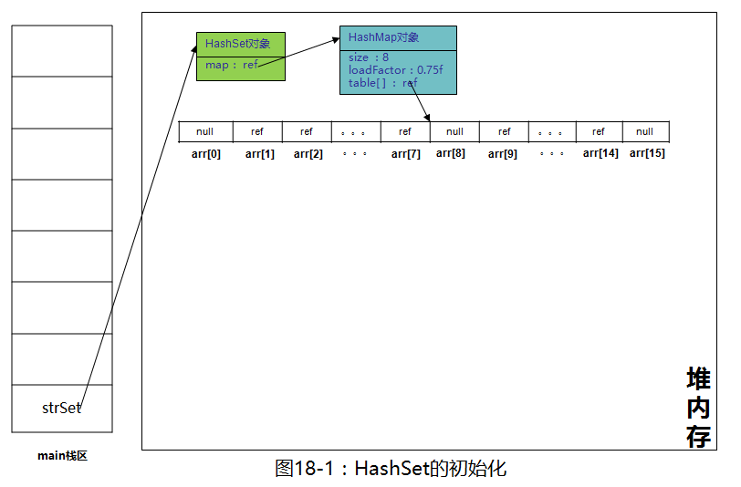
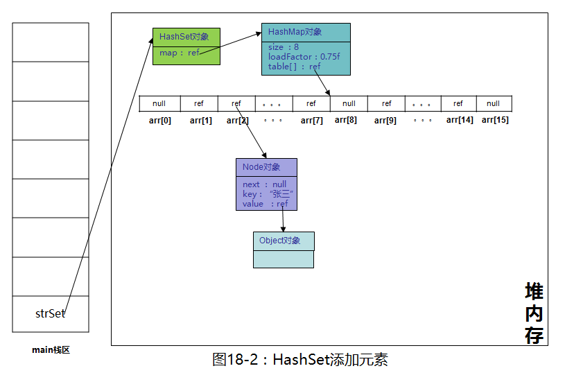
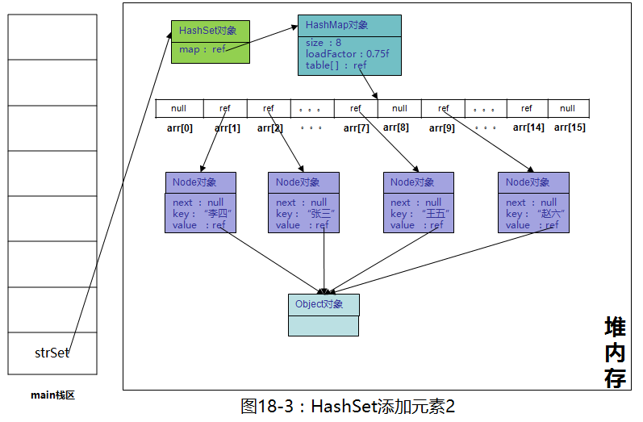

# Data Structure - hashset


[toc]


refers:
- [1](https://zhuanlan.zhihu.com/p/29021276)

---










所有元素的value都指向Object对象，HashSet虽然底层是用HashMap来实现的，但由于用不到HashMap的value，所以不会为底层HashMap的每个value分配一个内存空间，因此并不会过多的占用内存，请放心使用。

---

## code

```java
public class HashSet {


    public hashSet() {
        map = new HashMap<>();
    }


    public HashSet(Collection<? extends E> c) {
        map = new HashMap<>( Math.max((int) (c.size()/.75f) + 1, 16) );
        addAll(c);
    }


    public static void main (String[] args){

        Set<Integer> mySet1 = new HashSet<Integer>();
        mySet1.add(1);
        mySet1.add(2); // return boolean true of false

        mySet1.size();
        mySet1.isEmpty();
        mySet1.contains(1);

        mySet1.clear();


        Set<String> mySet2 = new HashSet<String>();
        mySet2.add("hello");
        mySet2.add("world");

        // mySet.get(); not allow

        for(int num : mySet) {
            System.out.println(num);
        }
    }
}
```
